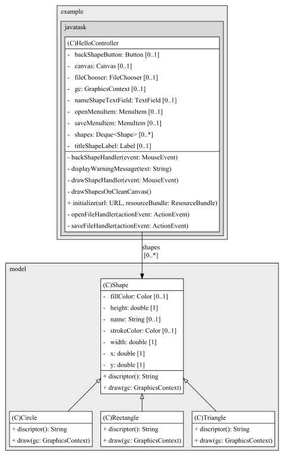
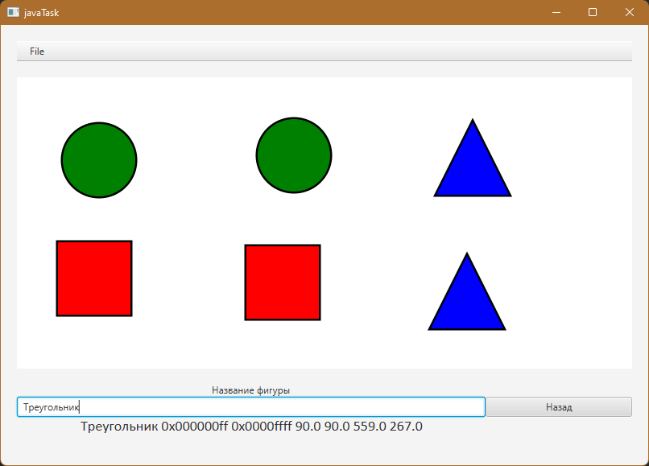
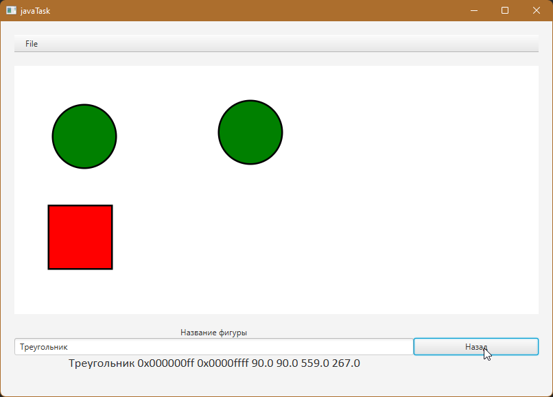
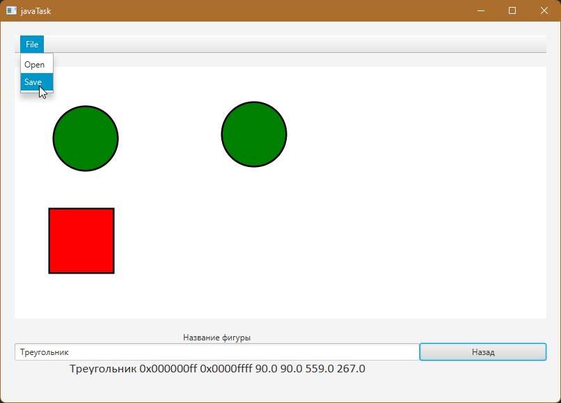

## Task2 | Фабричный метод
### Условия задачи
Требуется написать программу, которая рисует фигуру по заданному пользователем названию фигуры 
Вариант фигур: Круг, Прямоугольник, Треугольник.
### Теоретическая справка
Фабричный метод — это порождающий паттерн проектирования, который определяет общий интерфейс для создания объектов в суперклассе, позволяя подклассам изменять тип создаваемых объектов.
### Диаграмма классов

### Результат

