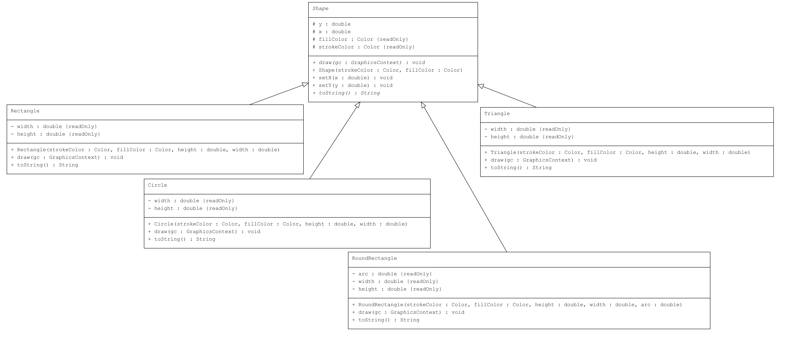
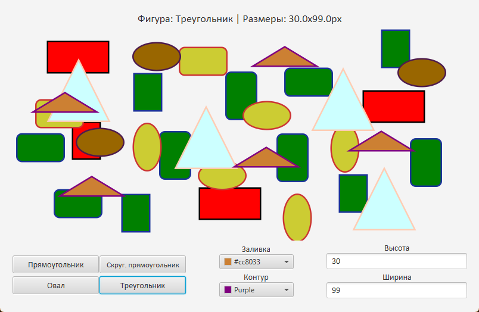

## Task1 | Абстрактный класс
### Условия задачи
Требуется написать программу, которая реализует следующую иерархию для отображения фигур и позволяет отобрать указанную на кнопке пользовательского интерфейса фигуру. 
Вариант фигур: овал, прямоугольник, скругленный прямоугольник, треугольник.
### Теоретическая справка
Абстрактный класс - класс, выступающий в этой роли, представляет собой абстрактный суперкласс, в котором инкапсулирована общая логика связанных классов. Связанные классы расширяют этот класс. Таким образом, они могут наследовать его методы. Методы с одинаковыми сигнатурами и общей логикой для всех связанных классов помещаются в суперкласс, поэтому логика этих методов может наследоваться всеми подклассами данного суперкласса. Методы с зависящей от конкретного подкласса данного суперкласса логикой, но с одинаковыми сигнатурами, объявляются в абстрактном классе как абстрактные методы, тем самым гарантируя, что каждый конкретный подкласс будет иметь методы с такими же сигнатурами.
### Диаграмма классов

### Результат

